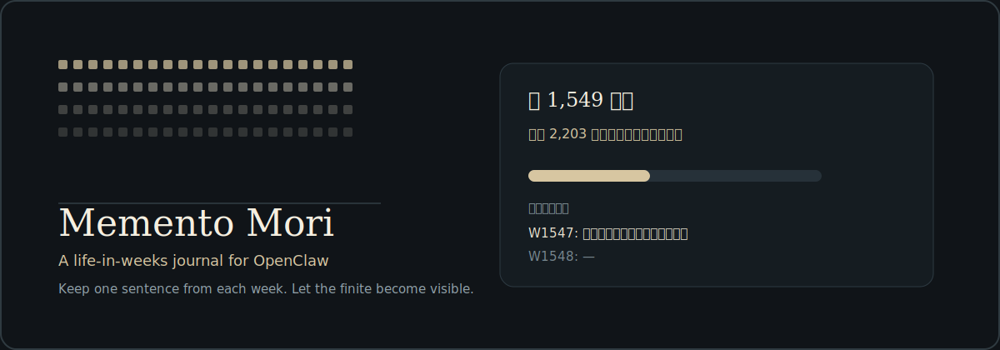
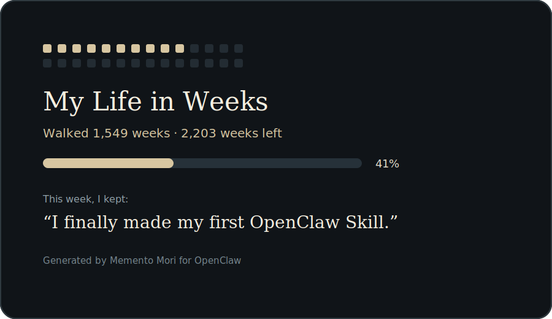
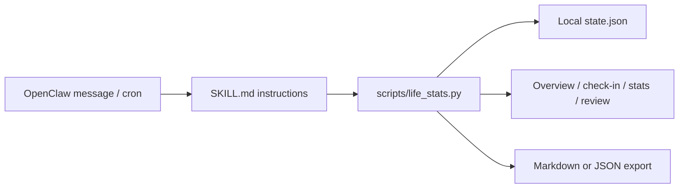

<p align="center">
  
</p>

# Memento Mori: A Life-in-Weeks Journal for OpenClaw

[中文说明](README.zh-CN.md)


[](LICENSE)

Most people do not live in years.
They live in weeks.

Memento Mori turns your life into a finite number of weeks, then asks one quiet question every Sunday:

> What is worth keeping from this week?

It is not a productivity tracker. It is an AI companion ritual: a local-first OpenClaw skill for seeing time, keeping one sentence, and letting ordinary weeks become visible.

It turns life into weeks, not to optimize you, but to return one nearly forgotten week to memory.

## Demo Moment

```text
You have lived 11,363 days.

At an 85-year life expectancy,
your life is about 4,435 weeks.

You have used 1,623 weeks.
About 2,812 weeks remain.

████████████░░░░░░░░░░░░░░░░░░░░ 37%

This is not a countdown.
It is a reminder:
some weeks should not pass blank.

What do you want to keep from this week?
```

## Share Card

<p align="center">
  
</p>

## What It Does

| Area | What is implemented |
|---|---|
| Life overview | Days lived, weeks lived, weeks left, progress bar, estimated end date |
| Weekly check-in | OpenClaw cron-friendly `checkin` command with milestone de-duplication |
| Voice styles | `stoic`, `gentle`, `sharp`, `poetic`, and `minimal` check-in modes |
| Journal | Stores both raw user wording and a concise summary |
| Share card | Screenshot-friendly text card and SVG export via `share` |
| Review | Recent-week stats, empty weeks, streaks, top terms, annual review data |
| Export | Markdown and JSON export, either printed or written to a file |
| Safety | Avoids countdown framing when the user expresses self-harm or acute hopelessness |
| Privacy | Local-only state file; no network requests from the bundled script |

## Architecture



## Repository Structure

```text
SKILL.md                    OpenClaw skill instructions and frontmatter
scripts/life_stats.py       Deterministic local state and calculation script
references/install.md       Installation, scheduling, and local setup notes
references/philosophy.md    Tone, design philosophy, and safety boundary
tests/                      Minimal regression tests for the script
```

## Quick Start

Clone the repository into an OpenClaw skills directory:

```powershell
git clone https://github.com/alexhuang-dev/memento-mori-openclaw.git "$env:USERPROFILE\.openclaw\skills\memento-mori"
```

Workspace installs also work, but runtime state is stored in `~/.openclaw/skills/memento-mori/state.json` by default unless `MEMENTO_MORI_STATE` is set.

Restart or refresh OpenClaw so it reloads skills:

```powershell
openclaw skills list
openclaw skills check
```

Then invoke it from an OpenClaw conversation:

```text
Use $memento_mori to initialize me. My birthdate is 1995-03-15 and use 85 years as the default life expectancy.
```

## Manual Script Use

Run commands from the repository root:

```bash
python scripts/life_stats.py setup --birthdate 1995-03-15 --life-expectancy-years 85
python scripts/life_stats.py read
python scripts/life_stats.py journal --entry "This week had one thing worth keeping." --summary "Kept one thing from the week."
python scripts/life_stats.py share
python scripts/life_stats.py share --format svg --out card.svg
python scripts/life_stats.py config set --checkin-style sharp
python scripts/life_stats.py stats --last-n 12
python scripts/life_stats.py review --year 2026
python scripts/life_stats.py export --format markdown --out journal.md
```

The state file defaults to:

```text
~/.openclaw/skills/memento-mori/state.json
```

For tests or custom deployments, override it:

```bash
MEMENTO_MORI_STATE=/tmp/memento-mori-state.json python scripts/life_stats.py read
```

## Weekly OpenClaw Cron

Manual use does not require cron. Use cron only when you want proactive weekly check-ins:

```bash
openclaw cron add \
  --name "memento-mori-weekly" \
  --cron "0 21 * * 0" \
  --tz "Asia/Shanghai" \
  --session isolated \
  --message "Use $memento_mori for the weekly check-in. Run checkin, mention at most one new milestone, then ask one short reflection question." \
  --announce \
  --channel last
```

Change `Asia/Shanghai` to your local timezone if needed.

## Safety And Privacy

- The script is local-only and does not make network requests.
- The journal can contain sensitive personal reflections. Do not commit `state.json` or exported journals.
- If the user expresses self-harm intent, suicidal thoughts, immediate danger, or severe hopelessness, the skill instructions require the agent to pause countdown framing and respond with crisis-safe support.

## Development

Run the test suite:

```bash
python -m unittest discover -s tests
```

Run a quick smoke test:

```bash
python scripts/life_stats.py setup --birthdate 1995-03-15 --life-expectancy-years 85
python scripts/life_stats.py checkin
```

## Positioning

```text
Not a productivity tracker.
A memory ritual.

Not a dashboard.
A quiet weekly interruption.

Not a life hack.
A small box for the week you almost forgot.
```

## License

MIT License. See [LICENSE](LICENSE).
