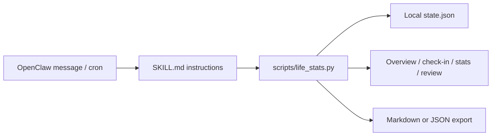

# Memento Mori OpenClaw Skill


[](LICENSE)

[中文说明](README.zh-CN.md)

Memento Mori is an OpenClaw skill that turns "life in weeks" into a quiet weekly reflection system. It calculates how many days and weeks have passed, estimates the remaining weeks from a user-provided life expectancy, asks one weekly question, and keeps a local journal of the answers.

This is not a productivity tracker. It is a small self-archaeology tool: sober enough to make time visible, gentle enough not to turn mortality into pressure.

## What It Does

| Area | What is implemented |
|---|---|
| Life overview | Days lived, weeks lived, weeks left, progress bar, estimated end date |
| Weekly check-in | OpenClaw cron-friendly `checkin` command with milestone de-duplication |
| Journal | Stores both raw user wording and a concise summary |
| Review | Recent-week stats, empty weeks, streaks, top terms, annual review data |
| Export | Markdown and JSON export, either printed or written to a file |
| Safety | Avoids countdown framing when the user expresses self-harm or acute hopelessness |
| Privacy | Local-only state file; no network requests from the bundled script |

## Architecture



## Repository Structure

```text
SKILL.md                    OpenClaw skill instructions and frontmatter
scripts/life_stats.py       Deterministic local state and calculation script
references/install.md       Installation, scheduling, and ClawHub publishing notes
references/philosophy.md    Tone, design philosophy, and safety boundary
tests/                      Minimal regression tests for the script
```

## Quick Start

Clone the repository into an OpenClaw skills directory:

```powershell
git clone https://github.com/alexhuang-dev/memento-mori-openclaw.git "$env:USERPROFILE\.openclaw\workspace\skills\memento-mori"
```

Restart or refresh OpenClaw so it reloads skills:

```powershell
openclaw skills list
openclaw skills check
```

Then invoke it from an OpenClaw conversation:

```text
Use $memento_mori to initialize me. My birthdate is 1995-03-15 and use 85 years as the default life expectancy.
```

## Manual Script Use

Run commands from the repository root:

```bash
python scripts/life_stats.py setup --birthdate 1995-03-15 --life-expectancy-years 85
python scripts/life_stats.py read
python scripts/life_stats.py journal --entry "This week had one thing worth keeping." --summary "Kept one thing from the week."
python scripts/life_stats.py stats --last-n 12
python scripts/life_stats.py review --year 2026
python scripts/life_stats.py export --format markdown --out journal.md
```

The state file defaults to:

```text
~/.openclaw/skills/memento-mori/state.json
```

For tests or custom deployments, override it:

```bash
MEMENTO_MORI_STATE=/tmp/memento-mori-state.json python scripts/life_stats.py read
```

## Weekly OpenClaw Cron

Manual use does not require cron. Use cron only when you want proactive weekly check-ins:

```bash
openclaw cron add \
  --name "memento-mori-weekly" \
  --cron "0 21 * * 0" \
  --tz "Asia/Shanghai" \
  --session isolated \
  --message "Use $memento_mori for the weekly check-in. Run checkin, mention at most one new milestone, then ask one short reflection question." \
  --announce \
  --channel last
```

## ClawHub Publishing

From the repository root:

```bash
clawhub publish . --slug memento-mori --name "Memento Mori" --version 0.2.1 --tags life,journal,reflection,openclaw
```

## Safety And Privacy

- The script is local-only and does not make network requests.
- The journal can contain sensitive personal reflections. Do not commit `state.json` or exported journals.
- If the user expresses self-harm intent, suicidal thoughts, immediate danger, or severe hopelessness, the skill instructions require the agent to pause countdown framing and respond with crisis-safe support.

## Development

Run the test suite:

```bash
python -m unittest discover -s tests
```

Run a quick smoke test:

```bash
python scripts/life_stats.py setup --birthdate 1995-03-15 --life-expectancy-years 85
python scripts/life_stats.py checkin
```

## License

Apache License 2.0. See [LICENSE](LICENSE).

