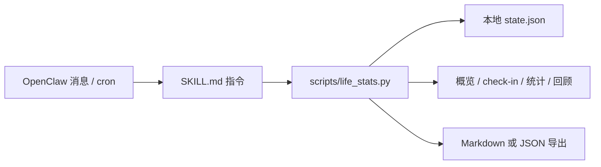

<p align="center">
  
</p>

# Memento Mori：人生以周为单位


[](LICENSE)

[English](README.md)

Memento Mori 是一个安静的 OpenClaw skill，给那些想把时间看得更清楚的人。它把人生折成一周一周的格子，在每周结束时问一个问题，再把答案留进本地日志。

它不是生产力工具，而是一种小小的仪式：提醒你生命有限，也提醒你有些星期值得被留下。

> 你不是在消耗时间，时间在消耗你。

## 功能概览

| 方向 | 已实现能力 |
|---|---|
| 生命概览 | 已活天数、已活周数、剩余周数、进度条、估算终点日期 |
| 每周提醒 | 适合 OpenClaw cron 的 `checkin` 命令，里程碑提醒会去重 |
| 周记 | 同时保存用户原文和一句忠实摘要 |
| 回顾 | 最近 N 周统计、空白周、连续记录、常见主题词、年度回顾数据 |
| 导出 | 支持 Markdown 和 JSON，可打印或写入文件 |
| 安全边界 | 用户表达自伤或强烈绝望时，不继续死亡倒计时叙事 |
| 隐私 | 脚本只读写本地 state 文件，不主动联网 |

## 架构



## 仓库结构

```text
SKILL.md                    OpenClaw skill 指令和 frontmatter
scripts/life_stats.py       本地状态、计算和导出的确定性脚本
references/install.md       安装、定时提醒和本地配置说明
references/philosophy.md    语气、设计哲学和安全边界
tests/                      最小回归测试
```

## 快速开始

克隆到 OpenClaw skills 目录：

```powershell
git clone https://github.com/alexhuang-dev/memento-mori-openclaw.git "$env:USERPROFILE\.openclaw\workspace\skills\memento-mori"
```

让 OpenClaw 重新加载 skills：

```powershell
openclaw skills list
openclaw skills check
```

然后在 OpenClaw 对话中调用：

```text
Use $memento_mori，帮我初始化。我生日是 1995-03-15，预期寿命先按 85 岁。
```

## 手动脚本用法

在仓库根目录运行：

```bash
python scripts/life_stats.py setup --birthdate 1995-03-15 --life-expectancy-years 85
python scripts/life_stats.py read
python scripts/life_stats.py journal --entry "这一周有一件事值得留下。" --summary "留下了这一周的一件事。"
python scripts/life_stats.py stats --last-n 12
python scripts/life_stats.py review --year 2026
python scripts/life_stats.py export --format markdown --out journal.md
```

默认 state 文件位置：

```text
~/.openclaw/skills/memento-mori/state.json
```

测试或自定义部署时可以改路径：

```bash
MEMENTO_MORI_STATE=/tmp/memento-mori-state.json python scripts/life_stats.py read
```

## 每周 OpenClaw Cron

手动使用不需要 cron。只有想让它主动每周出现一次时，才需要配置 cron：

```bash
openclaw cron add \
  --name "memento-mori-weekly" \
  --cron "0 21 * * 0" \
  --tz "Asia/Shanghai" \
  --session isolated \
  --message "Use $memento_mori for the weekly check-in. Run checkin, mention at most one new milestone, then ask one short reflection question." \
  --announce \
  --channel last
```

## 安全与隐私

- 脚本只在本地运行，不主动发起网络请求。
- 周记可能包含非常私人的内容，不要提交 `state.json` 或导出的 journal 文件。
- 如果用户表达自伤、自杀、立即危险或强烈绝望，skill 指令要求 agent 停止死亡倒计时叙事，改用危机场景下更安全的支持性回应。

## 开发

运行测试：

```bash
python -m unittest discover -s tests
```

快速烟测：

```bash
python scripts/life_stats.py setup --birthdate 1995-03-15 --life-expectancy-years 85
python scripts/life_stats.py checkin
```

## 许可证

Apache License 2.0。见 [LICENSE](LICENSE)。
